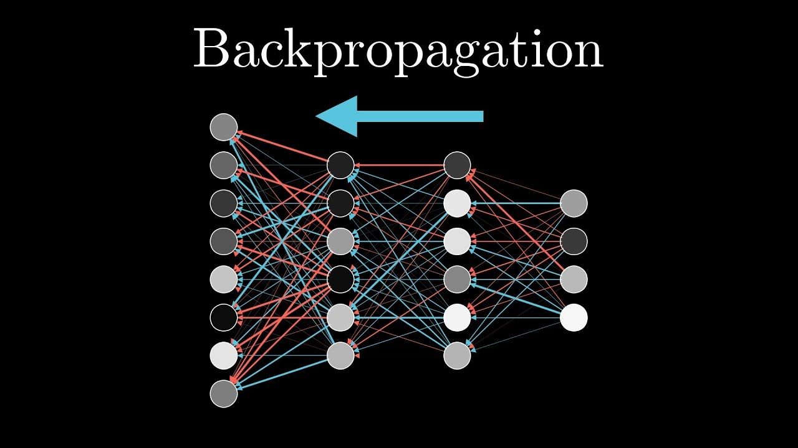

# Feed Forward Neural Network

In this project, I build up a Feed-Forward Neural Network with backpropagation from scratch.

Functions:
* sigmoid - sigmoid function
* ffnn - Feed-Forward Neural Network structure and workflow
* loss - to measure the performance afterwards
* backprop - replicate backpropagation behaviour for weights updating

It finally plot the loss values over the iterations.
